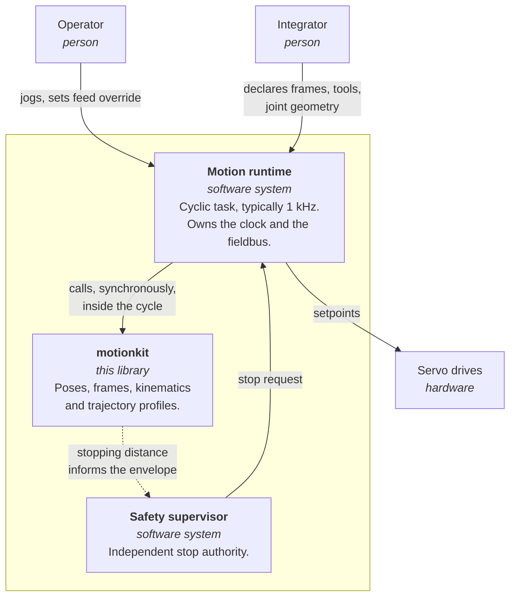
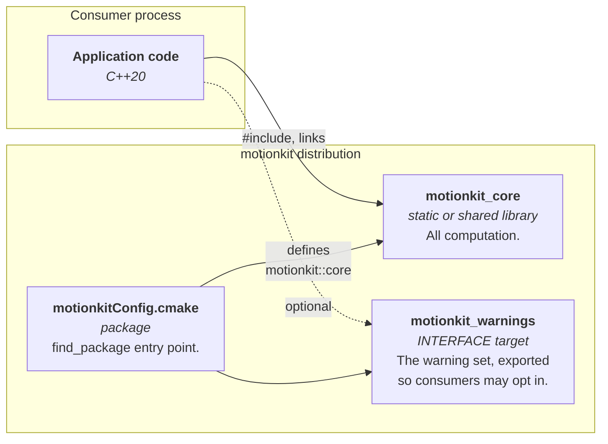
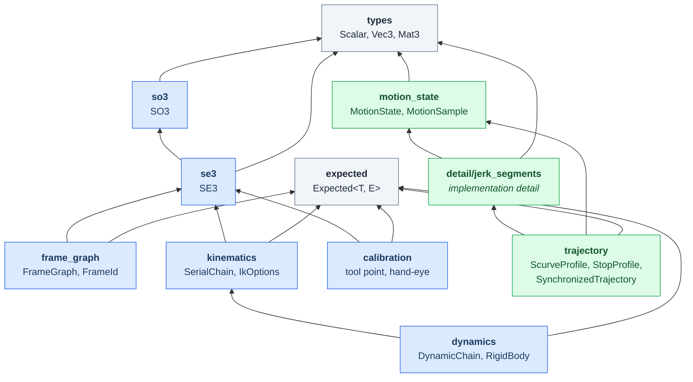

# Architecture

A C4 description of motionkit at three zoom levels, followed by the rules that
decide where new code goes. The diagrams are Mermaid, so they render on GitHub;
in the Doxygen reference they appear as source, which is the honest trade for
not adding a diagram toolchain to the build.

The audience is someone deciding whether to depend on this library, or where to
put their next change in it.

## Level 1 — Context

motionkit is a library, not a process. It computes; it never talks to hardware,
never owns a thread, and never decides when it is called. Everything with an
arrow into it is somebody else's process.

The dashed edge is the only claim motionkit makes about safety, and it is
deliberately weak. `StopProfile` computes how far an axis travels once a stop
begins; a supervisor may use that to size a safety envelope. motionkit is not
the stop authority and is not built to any functional-safety integrity level.
The supervisor exists precisely because a library linked into the same process
as the motion it supervises cannot be its own independent check.

## Level 2 — Containers

Two containers rather than one because the warning set is a separate promise
from the code. A consumer who wants motionkit's diagnostics can link
`motionkit::warnings`; one who has their own house style is not
forced into `-Wold-style-cast` by an include. Both are exported, and CI builds
a consumer against the *installed* package rather than the build tree, because
an export that only works in-tree fails in a stranger's project and not in
ours — see [ADR-0004](adr/0004-verify-the-installed-package-in-ci.md).

## Level 3 — Components

The header dependency graph, drawn from the actual `#include` edges rather than
from intent. `types.hpp` is at the bottom and depends on nothing.

### The two sides, and the one module that joins them

Two subtrees rise from `types`. The pose side — SO3, SE3, FrameGraph,
SerialChain, DynamicChain, calibration — answers *where*, and now *what force*.
The motion side — MotionState, ScurveProfile, StopProfile — answers *when*.
`trajectory.hpp` includes no `se3.hpp`, and neither `kinematics.hpp` nor
`dynamics.hpp` includes `motion_state.hpp`.

For most of this library's life those two never met, and that separation is
still the most useful thing to know before adding to it. Trajectory planning
here is over **scalar axes**: a profile knows a start, a goal and a set of
limits, and has no idea whether the number it moves is a joint angle, a rail
position or a spindle override. Kinematics maps joint angles to poses and has no
notion of time.

`dynamics` is the interesting test of that boundary, because it is plainly
*about* time — it takes joint velocities and accelerations — and it still sits
on the pose side. It takes them as bare `span<const Scalar>` rather than as a
`MotionState`, so it never learns where those numbers came from. That is not an
oversight to be tidied: a torque calculation has no use for the profile that
produced the acceleration, and coupling it to one would stop a caller with
measured encoder rates from using it at all.

**`cartesian` is the exception, and the only one.** It depends on both sides,
because a straight line in space traversed within joint limits cannot be
described by either alone. It is the newest module and the most delicate, and
the reason it was hard is visible in the diagram: everything else needs one
subtree, and this needs the relationship *between* them — which is the Jacobian,
and the Jacobian is different at every point on the path. Near a singularity it
demands unbounded joint rates for an ordinary tool speed, and the measured cost
is a factor of **7.4** on the duration of an otherwise identical 50 mm move.

That it is the only crossing is worth preserving. A second module reaching
across would make the boundary a suggestion; keeping the traffic through one
place means the awkward part of the design is in one file with an ADR attached
to it ([ADR-0012](adr/0012-cartesian-moves-are-paced-by-one-speed.md)).

What is still missing no longer sits on the motion side. `ReachProfile` plans
from an arbitrary state to a position, which is the piece blending was waiting
on; what remains is `CartesianPlan` using it, so that consecutive moves stop
carrying every waypoint down to rest. That, full time-optimal path
parameterisation, and CUDA batch inverse kinematics are the remaining WP-12c
items.

### Rules that decide where code goes

1. **Dependencies point down, never sideways within a level.** `se3` may use
   `so3`; `frame_graph` and `kinematics` are siblings and must not include one
   another. A change needing that edge is a change that wants a new module.
2. **`detail/` is not part of the promise.** It is excluded from the published
   reference. Anything a consumer may reasonably depend on belongs in a public
   header, where the documentation gate applies to it.
3. **Failures that a control loop can expect are values, not exceptions.**
   `Expected<T, E>` on the boundary; exceptions only where the caller has
   already violated a precondition, such as normalising a zero vector.
4. **Anything callable from the cyclic task allocates nothing and does not
   throw.** `lookup`, `sample`, `forward`, `jacobian` and `inverse` are all
   pinned by tests that replace global `operator new` and assert a zero delta.
